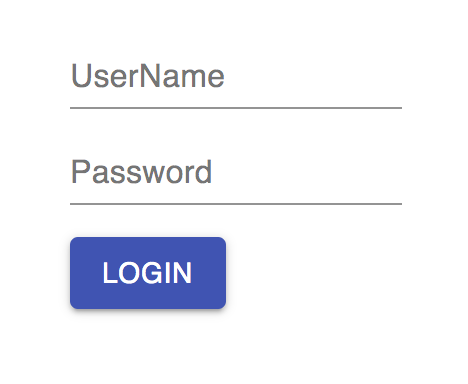

TypeScript React "material-ui" Form Vertical Fields Demo
========================================================

Material-UI关于form fields的例子都是横的，如何让fields竖向排列：

1. 在 TextField 中设置属性'fullWidth'，则会占满该行，从而竖向排列
2. 使用div或者Container等，把各个field隔开

本以为Material-UI有什么特殊的tag来做这件事，一直找不到，原来没有。

```
npm install
npm run demo
```

It will open <http://localhost:8080/> automatically.


